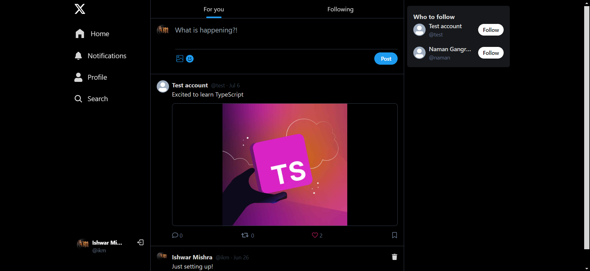
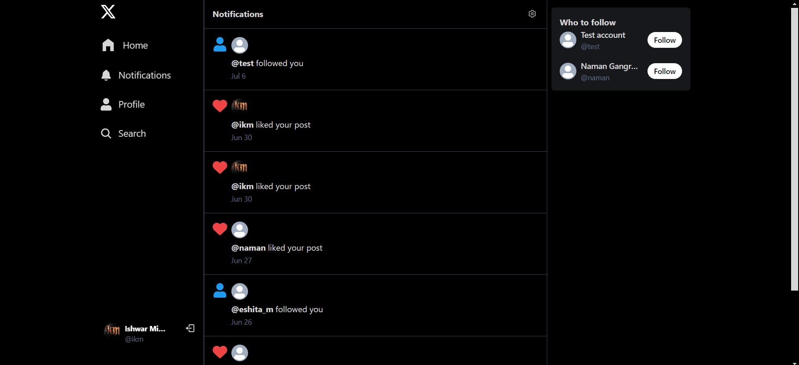
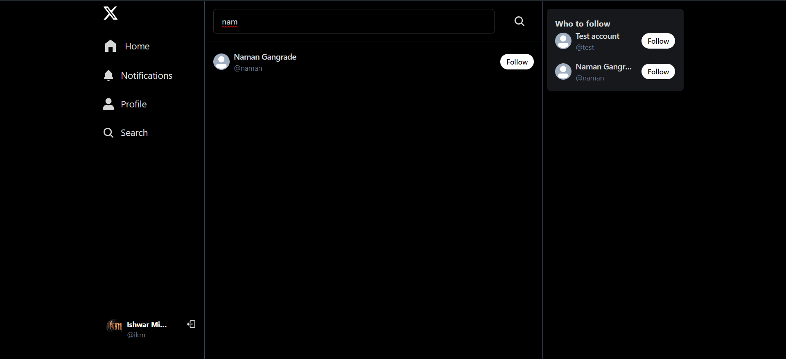
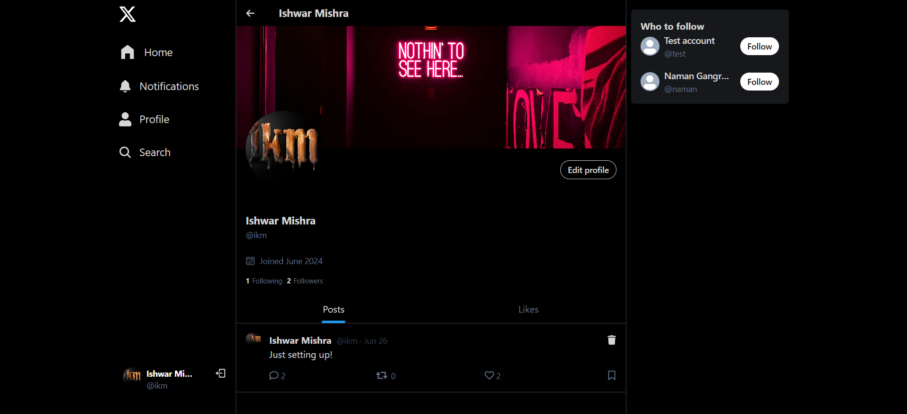
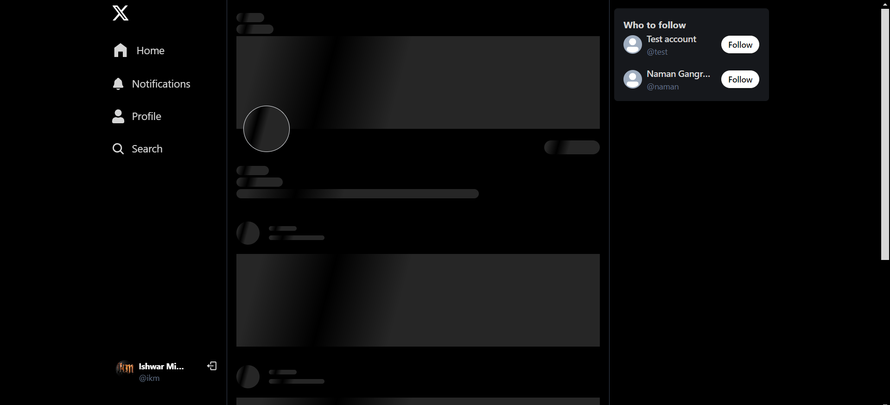

# Twitter Clone | [Live Demo](https://twitter-clone-4okj.onrender.com/)

A full-stack twitter clone application built with Node.js, Express, MongoDB, and React.

## Table of Contents

- [Twitter Clone | Live Demo](#twitter-clone--live-demo)
  - [Table of Contents](#table-of-contents)
  - [Overview](#overview)
  - [Features](#features)
  - [Technologies Used](#technologies-used)
  - [Backend Overview](#backend-overview)
    - [Dependencies](#dependencies)
    - [Environment Setup](#environment-setup)
    - [API Routes](#api-routes)
  - [Frontend Overview](#frontend-overview)
    - [Components](#components)
      - [Pages](#pages)
      - [Components](#components-1)
    - [Routes](#routes)
  - [Setup Instructions](#setup-instructions)
  - [Usage](#usage)
  - [Screenshots](#screenshots)
    - [Sign Up](#sign-up)
    - [Sign In](#sign-in)
    - [Home](#home)
    - [Notifications](#notifications)
    - [Search](#search)
    - [Profile](#profile)
    - [Skeleton](#skeleton)

## Overview

This project is a social media platform that allows users to create profiles, connect with other users, share posts, like posts, receive notifications, and more.

## Features

- User authentication (signup, login, logout).
- User profiles with profile images, cover images, bios, and external links.
- Posting functionality with text and optional images.
- Like and comment functionality on posts.
- Follow and unfollow other users.
- Notifications for follows and post likes.
- Search functionality to find other users.
- Responsive design for mobile and desktop views.

## Technologies Used

- **Backend**: Node.js, Express, MongoDB, Mongoose, Cloudinary (for image storage), dotenv (for environment variables).
- **Frontend**: React, React Router, TanStack/react-query (for data fetching), Tailwind CSS (for styling).

## Backend Overview

### Dependencies

- `express`: Web server framework for Node.js.
- `dotenv`: Loads environment variables from a `.env` file.
- `mongoose`: MongoDB object modeling tool.
- `cloudinary`: Cloud storage for images.
- Other relevant dependencies for routing, middleware, etc.

### Environment Setup

Create a `.env` file in the root directory of the backend with the following variables:

```env
PORT=your_preferred_port_number
MONGODB_URI=your_mongodb_connection_string
JWT_SECRET=your_jwt_secret
NODE_ENV=development

CLOUDINARY_CLOUD_NAME=your_cloudinary_cloud_name
CLOUDINARY_API_KEY=your_cloudinary_api_key
CLOUDINARY_API_SECRET=your_cloudinary_api_secret
```

### API Routes

- **Authentication Routes (`/api/auth`)**:
  - `/signup`: POST request to register a new user.
  - `/login`: POST request to authenticate and login.
  - `/logout`: POST request to log out the user.
  - `/me`: GET request to get current user details.

- **User Routes (`/api/users`)**:
  - `/profile/:username`: GET request to fetch user profile.
  - `/profile/:username/connections`: GET request to fetch user's followers and following.
  - `/suggested`: GET request to fetch suggested users.
  - `/searchUser/:searchTerm`: GET request to search for users.
  - `/follow/:id`: POST request to follow/unfollow a user.
  - `/update`: POST request to update user profile.

- **Post Routes (`/api/posts`)**:
  - `/all`: GET request to fetch all posts.
  - `/following`: GET request to fetch posts from users followed by current user.
  - `/likes/:id`: GET request to fetch liked posts of a user.
  - `/user/:username`: GET request to fetch posts by a specific user.
  - `/create`: POST request to create a new post.
  - `/like/:id`: POST request to like/unlike a post.
  - `/comment/:id`: POST request to comment on a post.
  - `/:id`: DELETE request to delete a post.

- **Notification Routes (`/api/notifications`)**:
  - `/`: GET request to fetch notifications for the current user.
  - `/`: DELETE request to delete notifications.


## Frontend Overview

### Components

#### Pages

- `HomePage`: Displays the home page content.
- `SignUpPage`: Allows users to sign up for the application.
- `LoginPage`: Allows users to log in to the application.
- `NotificationPage`: Displays notifications for the logged-in user.
- `ProfilePage`: Displays user profile information.
- `SearchPage`: Allows users to search for other users.
- `Followers_Following`: Displays followers and following of a user.

#### Components

- `Sidebar`: Displays navigation links and user-related actions.
- `RightPanel`: Displays additional information or actions related to the current page.
- `LoadingSpinner`: Shows a loading spinner while fetching data.
- `Toaster`: Displays toast notifications.

### Routes

- `/`: Displays `HomePage` if authenticated, otherwise redirects to `/login`.
- `/signup`: Displays `SignUpPage` if not authenticated, otherwise redirects to `/`.
- `/login`: Displays `LoginPage` if not authenticated, otherwise redirects to `/`.
- `/notifications`: Displays `NotificationPage` if authenticated, otherwise redirects to `/login`.
- `/profile/:username`: Displays `ProfilePage` for the specified user if authenticated, otherwise redirects to `/login`.
- `/search`: Displays `SearchPage` if authenticated, otherwise redirects to `/login`.
- `/profile/:username/:type`: Displays `Followers_Following` for the specified user if authenticated, otherwise redirects to `/login`.

## Setup Instructions

To run this project locally, follow these steps:

1. Clone this repository.
2. Navigate to the `root` directory and create a `.env` file based on the provided `.env.example`.
3. Install dependencies using `npm install`.
4. Start the backend server using `npm run dev`.
5. Create a new terminal and navigate to the `frontend` directory and install dependencies using `npm install`.
6. Start the frontend development server using `npm rundev`.
7. Open your browser and go to `http://localhost:5000` to view the application.

## Usage

- Register a new account using the `SignUpPage`.
- Log in with your credentials using the `LoginPage`.
- Navigate through different pages using the sidebar.
- Create posts, like posts, and comment on posts.
- View notifications for follows and likes on the `NotificationPage`.
- Search for other users using the `SearchPage`.
- View user profiles and their followers/following on the `ProfilePage`.

## Screenshots

### Sign Up


### Sign In


### Home


### Notifications


### Search


### Profile


### Skeleton

